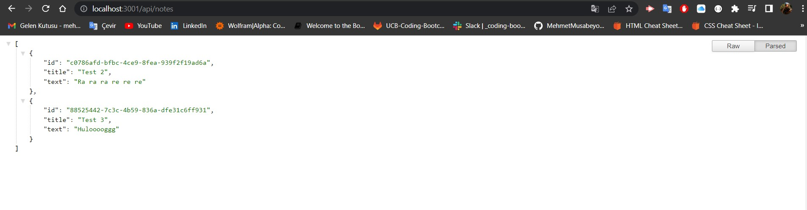

# Note Taker


## Table of Contents
* [Description](#description)
* [Deployed Link](#deployed-link)
* [User Story](#user-story)
* [Screenshots](#screenshots)
* [Code Snippet](#code-snippet)
* [Technologies Used](#technologies-used)
* [Credits](#credits)
* [Author Links](#author-links)
* [License](#license)


## Description

This is a note taker application that can be used to write, save, and delete custom notes through a simple user interface. This application uses an Express.js for its back end and uses a JSON file as its database structure. When user writes a new note and clicks save button, this note is saved into the JSON file and displayed on the left side bar. When user clicks on one of the saved notes on the left side bar, this note is retrieved from the JSON file and displayed on the webpage. When user clicks on the delete button next to a saved note, this note is deleted from the JSON file and not displayed on the left side bar anymore.   


## Deployed Link

Deployed link is [here](https://mehmet-note-taker.herokuapp.com/)


## User Story

| As a                   | I want to                       | So that   
| ---------------------- | ------------------------------- | ----------------------------------------------------------------------- |
| `Small business owner` | be able to write and save notes | `I can organize my thoughts and keep track of tasks I need to complete` |


## Screenshots

### *1. Functionality of the application*

<p align="center">
  
</p>


### *2. Application look*


### *3. Saved notes as JSON*




## Code Snippet

### Post method:
####  The server-side post method for saving new note to the database.
```

routerApi.post('/api/notes', (req, res) => {

    let { title, text } = req.body;

    title = title.trim();
    text = text.trim();

    if (title && text) {

        const newNote = {
            id: uuidv4(),
            title,
            text,
        };

        readFromDatabase('./db/db.json').then((data) => {
            let dbNotes = JSON.parse(data);
            dbNotes.push(newNote);
            writeToDatabase('./db/db.json', dbNotes);
        });

        const response = {
            status: 'success',
            body: newNote,
        };

        res.json(response);
    } else {
        res.json('Error in posting note!');
    }
});

```

### Delete method:
####  The server-side delete method for deleting saved notes from the database.
```

routerApi.delete('/api/notes/:id', (req, res) =>
    readFromDatabase('./db/db.json').then((data) => {

        let dbNotes = JSON.parse(data);

        dbNotes = dbNotes.filter((note) => {
            return note.id !== req.params.id;
        })

        writeToDatabase('./db/db.json', dbNotes);

        res.json(JSON.parse(data));
    })
);

```


## Technologies Used

- JavaScript
- HTML
- CSS
- Node.js
- Insomnia
- Bootstrap
- Npm Express
- Npm Uuid 
- Gitbash
- Heroku
- GitHub    
- Screencastify


## Credits

[Insomnia](https://docs.insomnia.rest/)

[Npm Express 4.16.4 Documentation](https://www.npmjs.com/package/express/v/4.16.4)

[Npm Uuid 8.3.2 Documentation](https://www.npmjs.com/package/uuid/v/8.3.2)


## Author Links

[LinkedIn Profile](https://www.linkedin.com/in/mehmet-musabeyoglu)

[GitHub Profile](https://github.com/MehmetMusabeyoglu)

[E-mail Address](mailto:mehmetmusabeyoglu@gmail.com) 


## License 

 This project is licensed under the MIT License 
 <br>
 [](https://opensource.org/licenses/MIT)